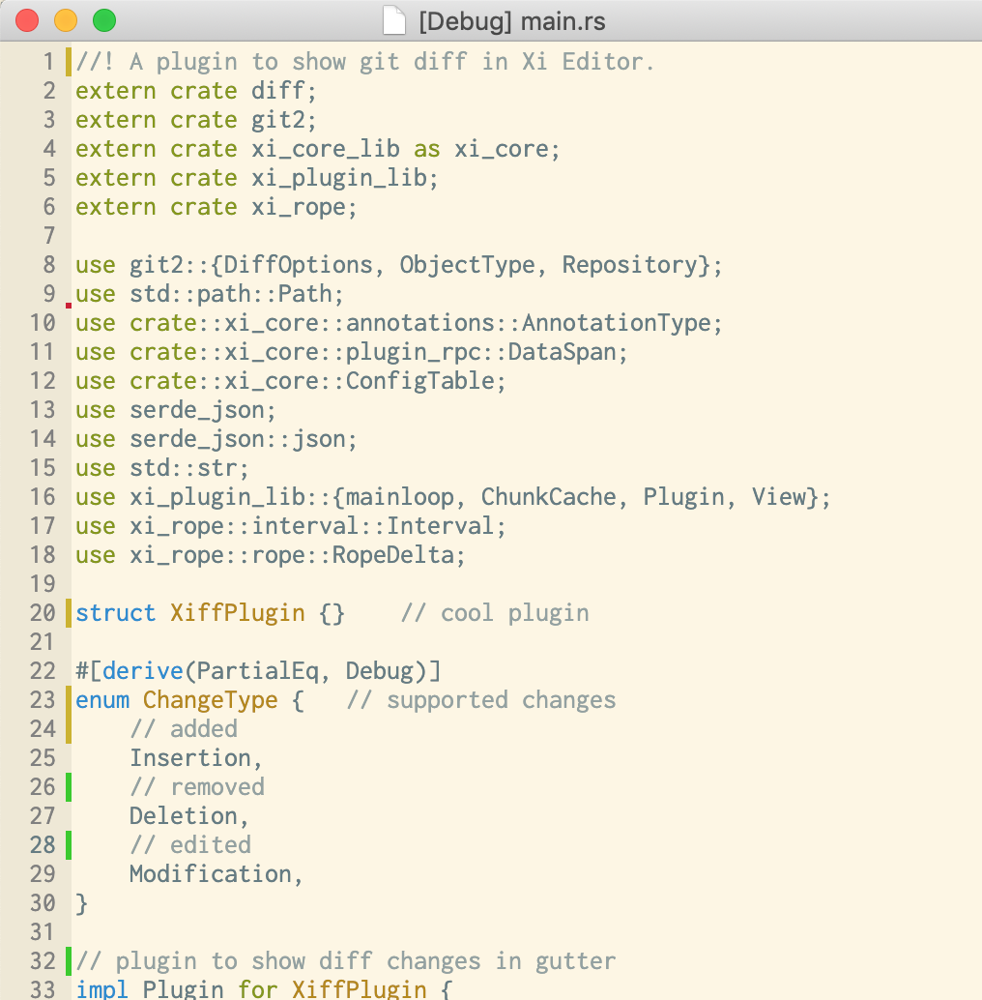

# Xiff - Plugin to show file diffs in Xi Editor

> Note: This project is work in progress and currently not stable nor supported by default by xi-mac.

This plugin shows file diffs in the gutter of Xi Editor.

## Installation

tldr; `make install`.

To install this plugin, the plugin manifest must be placed in a new directory under
$XI_CONFIG_DIR/plugins, where $XI_CONFIG_DIR is the path passed by your client
to xi core via the `client_started` RPC's `config_dir` field, on startup.
On MacOS, by default, $XI_CONFIG_DIR is located at ~/Library/Application Support/XiEditor.

Additionally, the compiled binary should be placed in a `bin/` subdir of the
directory containing the manifest. (This is the default; the location can be
changed in the manifest.)

Currently this plugin requires a special branch of xi-mac which adds support for gutter annotations: https://github.com/scholtzan/xi-mac/tree/diff-annotations

## Known Issues and Roadmap

- [ ] https://github.com/xi-editor/xi-editor/issues/1181
- [ ] Default `RENDER_DELAY` in xi-editor is too low and needs to be increased
- [ ] Gutter annotations not supported by xi-mac by default yet (special branch available)
- [ ] When scrolling the gutter annotations currently do not get updated
- [ ] Currently only works for files that are part of a git repository
- [ ] Does not register git commits, gutter annotations will still be shown until an edit is made
- [ ] Deletions/insertions could be shown in the status bar 